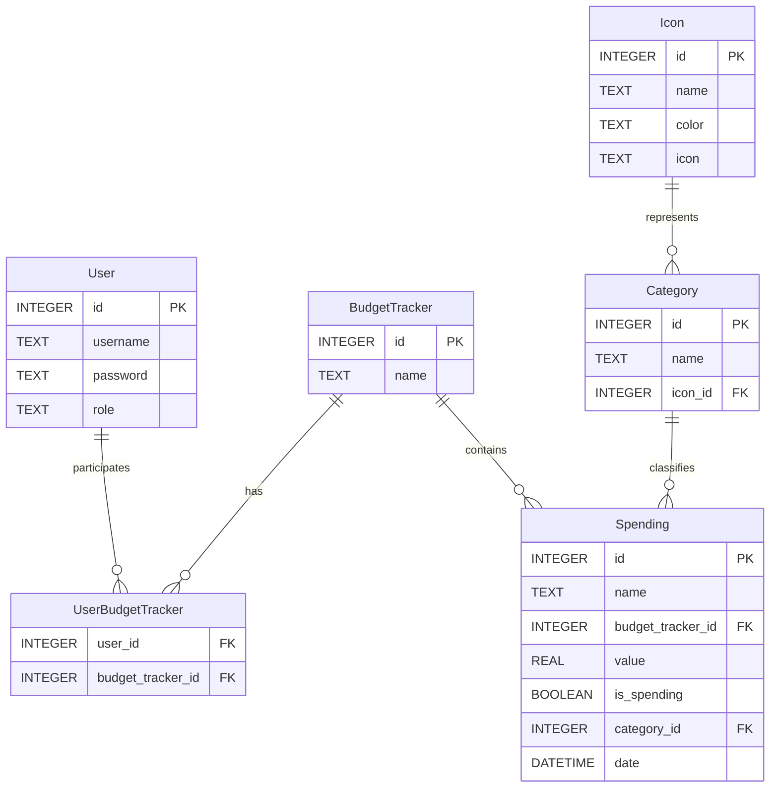

# spendly
[WIP] Budget tracker for my gf

## DB Schema

```mermaid
erDiagram
  User {
    INTEGER id PK
    TEXT username
    TEXT password
    TEXT role
  }

  Icon {
    INTEGER id PK
    TEXT name
    TEXT color
    TEXT icon
  }

  BudgetTracker {
    INTEGER id PK
    TEXT name
  }

  UserBudgetTracker {
    INTEGER user_id FK
    INTEGER budget_tracker_id FK
  }

  Category {
    INTEGER id PK
    TEXT name
    INTEGER icon_id FK
  }

  Spending {
    INTEGER id PK
    TEXT name
    INTEGER budget_tracker_id FK
    REAL value
    BOOLEAN is_spending
    INTEGER category_id FK
    DATETIME date
  }

  User ||--o{ UserBudgetTracker : participates
  BudgetTracker ||--o{ UserBudgetTracker : has
  BudgetTracker ||--o{ Spending : contains
  Category ||--o{ Spending : classifies
  Icon ||--o{ Category : represents
```
